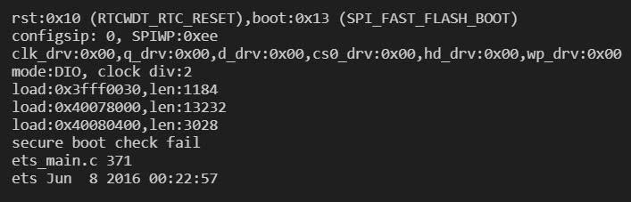
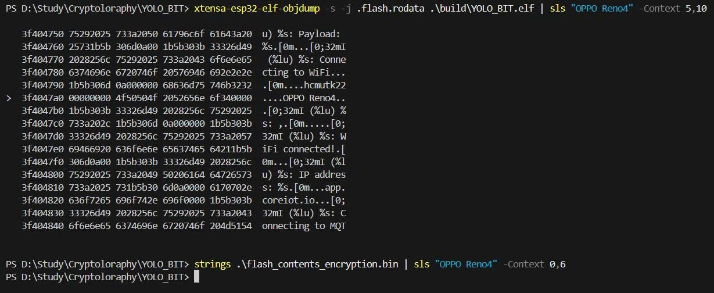

# IoT Security: Secure Boot V1 & Flash Encryption trên ESP32

**BTL môn Mật mã và An ninh mạng (HCMUT)**

Tài liệu này hướng dẫn chi tiết quy trình triển khai cơ chế **Secure Boot V1** và **Flash Encryption** trên vi điều khiển ESP32 (Revision v1.1 trở về trước) sử dụng ESP-IDF Framework. Mục tiêu là đảm bảo tính toàn vẹn (Integrity), xác thực (Authenticity) và bí mật (Confidentiality) cho Firmware.

## 1. Yêu cầu hệ thống

### Phần cứng
*   ESP32 DevKit V1 (Chip Revision 1.x - hỗ trợ Secure Boot V1).

### Phần mềm
*   ESP-IDF v5.1 (hoặc mới hơn).
*   Python 3.x.
*   Drivers: CP210x hoặc CH340 (tùy mạch).

## 2. Cấu hình Project (`sdkconfig`)

Chạy lệnh `idf.py menuconfig` và thiết lập tại `Security Features`:

### 2.1. Secure Boot
-   `[x]` Enable Secure Boot (`CONFIG_SECURE_BOOT=y`)
-   `[x]` Secure Boot V1 (`CONFIG_SECURE_BOOT_V1_ENABLED=y`)
-   `[x]` Reflashable Bootloader (`CONFIG_SECURE_BOOTLOADER_REFLASHABLE=y`)
    > *Lưu ý: Quan trọng để cho phép cập nhật lại bootloader nếu cần.*
-   `[x]` Sign binaries during build (`CONFIG_SECURE_BOOT_BUILD_SIGNED_BINARIES=y`)
-   `[x]` Secure Boot Signing Key: Chọn đường dẫn đến file `secure_boot_signing_key.pem`.

### 2.2. Flash Encryption
-   `[x]` Enable Flash Encryption (`CONFIG_SECURE_FLASH_ENC_ENABLED=y`)
-   `[x]` Mode: Development (`CONFIG_SECURE_FLASH_ENCRYPTION_MODE_DEVELOPMENT=y`)
    > *Lưu ý: Chế độ Development cho phép cập nhật firmware qua UART (hạn chế số lần). Chế độ Release sẽ khóa hoàn toàn.*
-   `[x]` Enable usage of UART bootloader for flashing (`CONFIG_SECURE_FLASH_UART_BOOTLOADER_ALLOW_ENC=y`)

### 2.3. Flash Memory Partition

                            0x0+-------------------+
                               |   SB1 Digest      |
                               |                   |
                         0x1000+-------------------+
                               |   Bootloader      |
                               |                   |
                        0x10000+-------------------+
                               |   Partition table |
                               |                   |
                        0x11000+-------------------+
                               |   NVS             |
                               |                   |
                        0x17000+-------------------+
                               |   Physic_init     |
                               |                   |
                        0x20000+-------------------+
                               |   Factory app     |
                               |                   |
                               ↓                   ↓

## 3. Quy trình Tạo Khóa (Key Generation)

Tạo thư mục `secure_keys/` để lưu trữ khóa.

*   **Tạo khóa Secure Boot (ECDSA P-256):**
    ```bash
    espsecure.py generate_signing_key secure_boot_signing_key.pem
    ```
*   **Tạo khóa Flash Encryption (AES-256):**
    ```bash
    espsecure.py generate_flash_encryption_key my_flash_encrypt_key.bin
    ```

## 4. Biên dịch (Build)
```bash
idf.py build
```
Hệ thống sẽ tự động ký firmware (`YOLO_BIT.bin`) và bootloader (`bootloader.bin`) bằng khóa đã cấu hình.

## 5. Nạp Khóa & Kích hoạt Bảo mật (One-Time Setup)

> *Lưu ý: Thay `PORT` bằng cổng COM thực tế (VD: `COM3`, `/dev/ttyUSB0`).*

*   **Burn khóa Secure Boot (Block 2):**
    ```bash
    espefuse.py -p PORT burn_key secure_boot_v1 build/bootloader/secure-bootloader-key-256.bin
    ```
*   **Kích hoạt Secure Boot V1:**
    ```bash
    espefuse.py -p PORT burn_efuse ABS_DONE_0
    ```
*   **Burn khóa Flash Encryption (Block 1):**
    ```bash
    espefuse.py -p PORT burn_key BLOCK1 my_flash_encrypt_key.bin
    ```
*   **Bảo vệ chống đọc (Khuyến nghị):**
    ```bash
    espefuse.py -p PORT burn_efuse DISABLE_DL_DECRYPT
    espefuse.py -p PORT burn_efuse DISABLE_DL_CACHE
    ```

## 6. Nạp chương trình lần đầu (First Flash)

Lần đầu tiên, ta nạp firmware dạng Plaintext. Bootloader sẽ tự động mã hóa dữ liệu này ngay trong lần khởi động đầu tiên.

*   **Nạp Bootloader & Digest (Bắt buộc cho SB V1):**
    ```bash
    esptool.py -p PORT write_flash 0x1000 build/bootloader/bootloader.bin
    esptool.py -p PORT write_flash 0x0 build/bootloader/bootloader-reflash-digest.bin
    ```
*   **Nạp Partition Table & App:**
    ```bash
    esptool.py -p PORT write_flash 0x10000 build/partition_table/partition-table.bin 0x20000 build/YOLO_BIT.bin
    ```
-> Restart thiết bị. Quá trình mã hóa sẽ diễn ra (mất khoảng 1-2 phút). Sau đó thiết bị sẽ chạy bình thường.

## 7. Quy trình Cập nhật Firmware (Secure Update)

Khi Flash Encryption đã bật, để cập nhật firmware mới (Ví dụ: thay đổi code từ v1.0 sang v2.0) mà không làm tăng bộ đếm eFuse, ta phải mã hóa thủ công (Pre-encryption) trên máy tính.

### Bước 1: Chuẩn bị khóa đảo ngược
Do khác biệt về Endianness giữa Host PC và ESP32, cần đảo ngược khóa Flash Encryption một lần duy nhất:
```python
python3 -c "import sys; open('my_flash_encrypt_key_reversed.bin', 'wb').write(open('my_flash_encrypt_key.bin', 'rb').read()[::-1])"
```

### Bước 2: Hiệu chỉnh Code & Build
Thực hiện thay đổi code (VD: sửa log `System Ready.` thành `System Ready`, để đánh dấu phiên bản mới) và build lại:
```bash
idf.py build
```

### Bước 3: Mã hóa Firmware thủ công
Sử dụng khóa đảo ngược để mã hóa file binary mới:
```bash
espsecure.py encrypt_flash_data --keyfile my_flash_encrypt_key_reversed.bin --address 0x20000 --output build/YOLO_BIT_encrypted.bin build/YOLO_BIT.bin
```

### Bước 4: Nạp Firmware đã mã hóa
```bash
esptool.py -p PORT write_flash 0x20000 build/YOLO_BIT_encrypted.bin
```

## 8. Kịch bản Tấn công & Kiểm chứng (Attack Scenarios)

Dựa trên báo cáo thực nghiệm, hệ thống đã ngăn chặn thành công các vector tấn công sau:

### 8.1. Kịch bản 1: Nạp Firmware giả mạo (Malware Injection)
*   **Tấn công:** Nạp file `YOLO_BIT_unsigned.bin` (chưa ký) hoặc file được ký bởi khóa hacker.
*   **Kết quả:** Hệ thống từ chối boot.
*   **Log:** `esp_image: Secure boot signature verification failed`


### 8.2. Kịch bản 2: Tấn công Bootloader (Bootloader Attack)
*   **Tấn công:** Ghi đè Bootloader gốc bằng Bootloader độc hại tại địa chỉ `0x1000`.
*   **Kết quả:** ROM phần cứng phát hiện sai lệch mã băm (Digest) và reset chip liên tục.
*   **Log:** `secure boot check fail, rst:0x10 (RTCWDT_RTC_RESET)`

### 8.3. Kịch bản 3: Trích xuất dữ liệu vật lý (Flash Dump)
*   **Tấn công:** Dùng `esptool.py read_flash` để sao chép dữ liệu Flash nhằm tìm Wifi Password, MQTT Credentials.
*   **Kết quả:** Dữ liệu thu được là rác (Ciphertext). Các chuỗi ký tự nhạy cảm (như "OPPO Reno4", "123456") không còn tồn tại dưới dạng văn bản rõ. Các chuỗi dữ liệu nhạy cảm trong flash rất dễ bị lộ khi bị dump ra và tìm chuỗi nếu không mã hóa.



## 9. Khôi phục sự cố (Troubleshooting)

*   **Boot Loop:** Kiểm tra xem đã nạp đúng `bootloader-reflash-digest.bin` vào địa chỉ `0x0` chưa.
*   **Lỗi Verify Signature:** Kiểm tra xem file `secure_boot_signing_key.pem` có khớp với public key đã nạp vào Bootloader không.
*   **Kiểm tra trạng thái eFuse:**
    ```bash
    espefuse.py -p PORT summary
    ```
    (Cần thấy `ABS_DONE_0 = True` và `FLASH_CRYPT_CNT > 0`).

---

# 10. Video demo
- __Secure Boot__: [Link demo secure boot](https://drive.google.com/file/d/1wVEZvIwGUfW9iSCX1eFsD-p6DHeIZLBD/view?usp=drive_link)
- __Flash Encryption__: [Link demo mã hóa bộ nhớ Flash](https://drive.google.com/file/d/1cHdHxLPkMgWmO28ehdTq-I1feDma0bIt/view?usp=drive_link)

*Thực hiện bởi: Nguyễn Duy Khiêm + Nguyễn Văn Huynh + Nguyễn Đăng Tuấn Tài  - Mật mã và An ninh mạng (HCMUT).*
